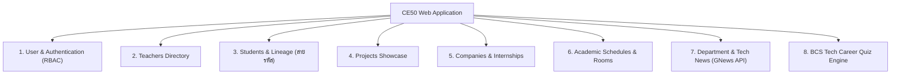
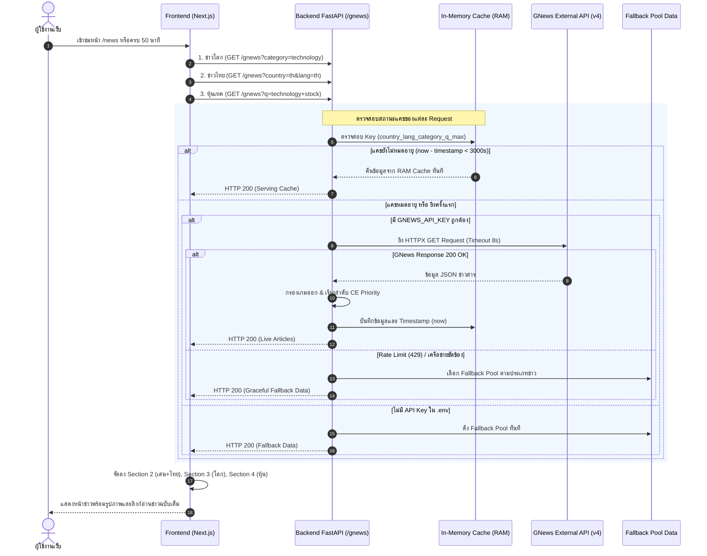
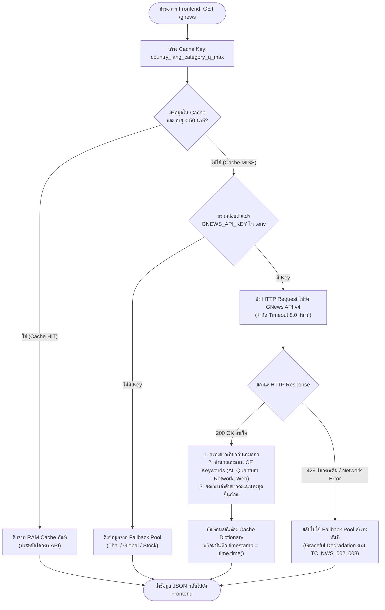
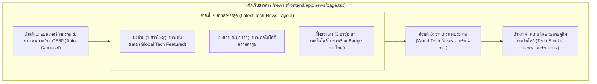
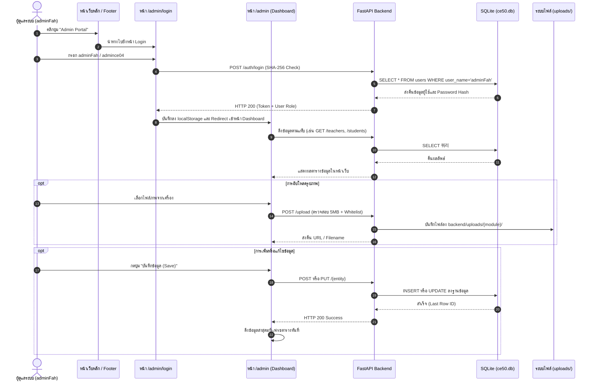
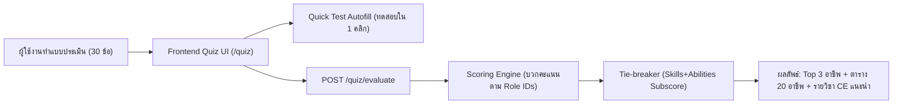
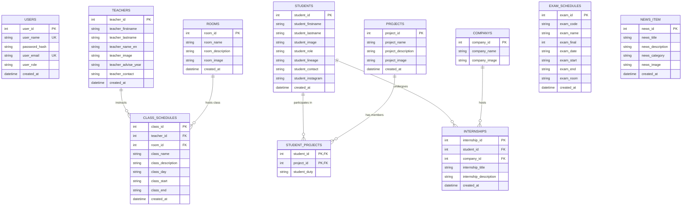

# เอกสารสรุปโครงการและข้อกำหนดการพัฒนาระบบ CE50 Web Application
*(CE50 Project Architecture & Backend/Database Specification)*

> **สาขาวิชาวิศวกรรมคอมพิวเตอร์ | วิชา Software Development Processes**  
> **เอกสารสำหรับ:** สายงานพัฒนา **Backend & Database** (ผู้รับผิดชอบ: **Fah**)  
> **Git Branch:** `fah-dev`  
> **ตำแหน่งไฟล์โครงการ:** `C:\Users\Asus\OneDrive\เดสก์ท็อป\CE50`

---

## สารบัญ (Table of Contents)
1. [บทนำและภาพรวมของโครงการ (Project Overview & Executive Summary)](#1-บทนำและภาพรวมของโครงการ-project-overview--executive-summary)
2. [ขอบเขตและฟังก์ชันการทำงานของระบบ (System Scope & Requirements)](#2-ขอบเขตและฟังก์ชันการทำงานของระบบ-system-scope--requirements)
3. [สถานะปัจจุบันของโครงการ - มีอะไรแล้วบ้าง (Current System Status)](#3-สถานะปัจจุบันของโครงการ---มีอะไรแล้วบ้าง-current-system-status)
4. [บทบาทและหน้าที่รับผิดชอบของ Fah (Backend & Database Responsibilities)](#4-บทบาทและหน้าที่รับผิดชอบของ-fah-backend--database-responsibilities)
   - 4.1 [ภารกิจที่ 1: การเชื่อมต่อ GNews API ดึงข่าวสารเทคโนโลยี](#41-ภารกิจที่-1-การเชื่อมต่อ-gnews-api-ดึงข่าวสารเทคโนโลยี-integrate-gnews-api)
   - 4.2 [ภารกิจที่ 2: ระบบจัดการหลังบ้าน Admin CRUD และระบบสิทธิ์ (RBAC)](#42-ภารกิจที่-2-ระบบจัดการหลังบ้าน-admin-crud-และระบบสิทธิ์-rbac)
   - 4.3 [ภารกิจที่ 3: ระบบประเมินสายอาชีพด้านไอที (Tech Career Quiz Engine)](#43-ภารกิจที่-3-ระบบประเมินสายอาชีพด้านไอที-tech-career-quiz-engine)
5. [การออกแบบสถาปัตยกรรมระบบ (Software Architecture & Design)](#5-การออกแบบสถาปัตยกรรมระบบ-software-architecture--design)
6. [การออกแบบฐานข้อมูล (Database Architecture & Schema Design)](#6-การออกแบบฐานข้อมูล-database-architecture--schema-design)
7. [เครื่องมือและเทคโนโลยีที่ใช้ในโครงการ (Tech Stack & Tooling)](#7-เครื่องมือและเทคโนโลยีที่ใช้ในโครงการ-tech-stack--tooling)
8. [การประกันคุณภาพและการทดสอบ (Quality Assurance & Test Matrix)](#8-การประกันคุณภาพและการทดสอบ-quality-assurance--test-matrix)
9. [แผนปฏิบัติงานทีละขั้นตอน (Step-by-Step Action Plan for Fah)](#9-แผนปฏิบัติงานทีละขั้นตอน-step-by-step-action-plan-for-fah)

---

## 1. บทนำและภาพรวมของโครงการ (Project Overview & Executive Summary)

### 1.1 ที่มาและวัตถุประสงค์
โครงการ **CE50 Web Application** เป็นระบบสารสนเทศแบบครบวงจร (Integrated Information Portal) ของภาควิชาวิศวกรรมคอมพิวเตอร์ สถาบันเทคโนโลยีพระจอมเกล้าเจ้าคุณทหารลาดกระบัง (KMITL PCC) พัฒนาขึ้นเพื่อเป็นศูนย์กลางดิจิทัลในการรวบรวมข้อมูล จัดการทรัพยากรทางการศึกษา ประชาสัมพันธ์ผลงาน และให้บริการแก่นักศึกษา คณาจารย์ รวมถึงบุคคลภายนอก 

จุดมุ่งหมายหลักในมุมมองวิศวกรรมซอฟต์แวร์ (Software Engineering Perspective):
1. **Centralized Data Hub**: รวบรวมข้อมูลสายรหัส (Student Lineage), คณาจารย์, ผลงานโครงงาน (Projects), ข้อมูลสถานที่ฝึกงาน (Internships), ตารางเรียน และตารางสอบ ไว้ในระบบฐานข้อมูลเชิงสัมพันธ์ที่เป็นระเบียบ
2. **Dynamic Knowledge & News**: นำเสนอข่าวสารภายในภาควิชา ควบคู่กับการดึงกระแสข่าวเทคโนโลยีระดับโลกผ่าน External API
3. **Interactive Career Guidance**: เสริมสร้างเครื่องมือแนะนำสายงานด้านเทคโนโลยี (Tech Career Quiz) ตามมาตรฐาน BCS เพื่อช่วยประเมินทักษะและแนะนำอาชีพที่เหมาะสมแก่นักศึกษา
4. **Administrative Governance**: มีระบบหลังบ้าน (Admin CRUD) พร้อมการควบคุมสิทธิ์ตามบทบาท (Role-Based Access Control) เพื่อให้ผู้ดูแลสามารถจัดการข้อมูลได้อย่างปลอดภัยและสะดวกรวดเร็ว

### 1.2 กลุ่มผู้ใช้งานระบบ (Target Users & Actors)
1. **Public Users / Prospective Students**: บุคคลภายนอกหรือนักเรียนที่สนใจ เข้ามาศึกษาหลักสูตร ทำความรู้จักคณาจารย์ ดูโครงงานรุ่นพี่ และทำแบบประเมินทักษะไอที
2. **Current Students (นักศึกษา CE)**: ค้นหาข้อมูลสายรหัส เบอร์ติดต่ออาจารย์ ตารางเรียน-ตารางสอบ ข้อมูลบริษัทที่รุ่นพี่เคยไปฝึกงานเพื่อวางแผนการฝึกงาน
3. **Staff / Writers (เจ้าหน้าที่ฝ่ายเนื้อหา)**: ผู้มีสิทธิ์เพิ่ม/แก้ไขข่าวสารและประชาสัมพันธ์กิจกรรม
4. **Administrators / Superadmin**: ผู้ดูแลระบบที่มีสิทธิ์เต็มในการจัดการบัญชีผู้ใช้งาน เพิ่ม/ลบ/แก้ไขข้อมูลหลักของภาควิชาทั้งหมด

---

## 2. ขอบเขตและฟังก์ชันการทำงานของระบบ (System Scope & Requirements)

### 2.1 Functional Requirements (FR)
ระบบแบ่งออกเป็น 8 โมดูลหลักตามข้อกำหนดวิชา Software Development:



1. **โมดูลคณาจารย์ (Teachers Management)**: แสดงรายชื่อ, วุฒิการศึกษา, อีเมล/ช่องทางติดต่อ, ปีที่ปรึกษา (Advise Year), ภาพถ่าย และรองรับระบบ Easter Egg
2. **โมดูลนักศึกษาและสายรหัส (Students & Lineage)**: บันทึกประวัตินักศึกษา, เลขสายรหัส (เช่น 006, 339, 800), รูปถ่าย, บทบาทหน้าที่ และช่องทางติดต่อ (เบอร์โทร, Instagram)
3. **โมดูลโครงงานนักศึกษา (Projects Showcase)**: จัดแสดงผลงานโครงงานระดับปริญญาตรี พร้อมรายชื่อนักศึกษาผู้พัฒนาและหน้าที่รับผิดชอบ (Student Duty)
4. **โมดูลการฝึกงานและบริษัท (Internships & Companies)**: บันทึกข้อมูลบริษัทพันธมิตรที่นักศึกษาเคยไปฝึกงาน, ตำแหน่งงาน, รายละเอียดประสบการณ์ และรายชื่อนักศึกษา
5. **โมดูลตารางเรียนและตารางสอบ (Class & Exam Schedules)**: 
   - ตารางเรียน: ระบุวิชา, วันในสัปดาห์, เวลาเริ่ม-สิ้นสุด, อาจารย์ผู้สอน และห้องเรียน
   - ตารางสอบ: ระบุรหัสวิชา, วันที่สอบ, ช่วงเวลา, ห้องสอบ และประเภทการสอบ (Midterm / Final)
6. **โมดูลห้องปฏิบัติการ (Rooms Directory)**: แสดงชื่อห้องแล็บ (เช่น E107, B218, E111), รายละเอียดอุปกรณ์ และรูปภาพห้อง
7. **โมดูลข่าวสารและบทความเทคโนโลยี (News & GNews API)**:
   - ข่าวสารภายในภาควิชา (จากฐานข้อมูล)
   - ข่าวสารเทคโนโลยีต่างประเทศ (ดึงผ่าน GNews REST API แบบไดนามิก)
8. **โมดูลแบบประเมินสายอาชีพ (BCS Tech Career Quiz)**: คำถาม 30 ข้อ ครอบคลุม 5 มิติ ประมวลผลคะแนนจับคู่กับ 20 บทบาทอาชีพสายเทคโนโลยี
9. **โมดูลระบบหลังบ้าน (Admin CRUD Panel)**: รองรับการ Create, Read, Update, Delete ทุก Entity พร้อมระบบอัปโหลดไฟล์รูปภาพ

### 2.2 Non-Functional Requirements (NFR)
- **Security & Authorization**: ป้องกันเส้นทางแอดมินด้วย Token/Session, ใช้ Password Hashing สำหรับรหัสผ่านผู้ใช้, แยกสิทธิ์ Superadmin, Admin, Writer ตามหลัก Principle of Least Privilege
- **Data Privacy & PDPA**: ป้องกันการรั่วไหลของข้อมูลส่วนบุคคล (เช่น เบอร์โทรศัพท์ และ Instagram ของนักศึกษา) ต้องไม่เปิดเผยผ่าน Public API หากไม่ได้รับอนุญาต
- **Reliability & Graceful Degradation**: ระบบต้องไม่พังเมื่อบริการภายนอก (GNews API) เกิดข้อผิดพลาด เช่น โควตาหมด (HTTP 429) หรือเครือข่ายขัดข้อง โดยต้องมีระบบสำรอง (Fallback Cache)
- **Maintainability**: เขียนโค้ดตามโครงสร้างโมดูลที่ชัดเจน ใช้ Absolute Path Resolution ป้องกันปัญหา Directory Path หลุดเมื่อรันจากต่างตำแหน่ง
- **Responsive Web Design**: ส่วนต่อประสาน (UI) ต้องรองรับทั้งหน้าจอ Desktop และ Mobile (เช่น Viewport 375px) ไม่ให้เกิดปัญหาข้อความล้นหรือ Horizontal Scrolling

---

## 3. สถานะปัจจุบันของโครงการ - มีอะไรแล้วบ้าง (Current System Status)

จากการตรวจสอบ Source Code ล่าสุดใน Branch `fah-dev`:

| องค์ประกอบ | สิ่งที่มีอยู่แล้วในระบบ | สถานะ / สิ่งที่ยังขาดหรือต้องปรับปรุง |
|---|---|---|
| **Frontend Framework** | Next.js 16.3.4 (App Router), React 19, TypeScript, Bootstrap 5.3.8, Tailwind CSS v4 | โครงสร้าง UI หลักพร้อมใช้งาน Navbar และ Footer เรียบร้อย |
| **Frontend Pages** | หน้า `/`, `/teachers`, `/students`, `/news`, `/projects`, `/company`, `/internship/[id]`, `/rooms`, `/exam`, `/class` | - หน้า `/news` ยังใช้รูป `/404.png` และข้อความ Mockup ในส่วนข่าวเทคโนโลยี<br>- หน้า `/internship/[id]` ยังขาดการ Join ข้อมูลระหว่าง Internship และ Student<br>- ยังไม่มีหน้า `/admin` (Admin CRUD) และหน้า `/quiz` |
| **Backend Framework** | FastAPI, Uvicorn, HTTPX client | เขียน API ไว้ใน `backend/main.py` แบบไฟล์เดี่ยว มีแต่ `GET` endpoints |
| **Database Schema** | ไฟล์สคริปต์ `docs/ce50_schema.txt` (SQLite) | ขาดตาราง `companys` ในไฟล์ Schema (ทำให้เกิดความขัดแย้งกับ `seed.py`), ยังไม่มีตารางสำหรับ Quiz |
| **Database Seeding** | สคริปต์ `backend/seed.py` สำหรับ Insert ข้อมูลเริ่มต้นครบทุกตาราง | - ยังไม่เป็น Idempotent (รันซ้ำแล้วข้อมูลเบิ้ลหรือติด Unique Constraint)<br>- ไม่ได้เปิด `PRAGMA foreign_keys = ON;` ในการเชื่อมต่อของ Python |
| **GNews Integration** | ฟังก์ชัน `@app.get("/gnews")` + Next.js UI | **[x] เสร็จสมบูรณ์ 100%**: Multi-Key In-Memory Cache (TTL 50 นาที), จัดลำดับความสำคัญหัวข้อ CE (AI/Quantum/Network/Web) คัดกรองข่าวเกมออก, ข่าวไทย/ข่าวโลก/หุ้นเทค, ระบบ Fallback สำรองครบถ้วนตาม TC_NWS_002, TC_NWS_003 |
| **Admin CRUD** | FastAPI REST Endpoints + Next.js Admin Panel | **[x] เสร็จสมบูรณ์ 100%**: Authentication (`/auth/login`) รองรับ SHA-256, จัดการสิทธิ์ RBAC (superadmin/admin/writer), Secure File Upload (`/upload`) จำกัด 5MB/Whitelist, CRUD ครบทุกตาราง (Teachers, Students [ใช้อีเมลแทนเบอร์โทร], News, Projects, Companies, Internships, Schedules, Rooms) พร้อมปุ่ม Footer และหน้า `/admin`, `/admin/login` |
| **Tech Career Quiz** | เอกสารข้อกำหนด `docs/bcs-tech-career-quiz.md` | ยังไม่ได้เริ่มเขียนทั้ง Logic ฝั่ง Backend และแบบฟอร์มฝั่ง Frontend |
| **เอกสารทดสอบ** | สคริปต์ `scripts/generate_test_cases_excel.py` (32 Test Cases) | เอกสารระบุชุดทดสอบ 8 โมดูลอย่างละเอียดมาก ใช้เป็นเกณฑ์ในการส่งมอบงาน |

---

## 4. บทบาทและหน้าที่รับผิดชอบของ Fah (Backend & Database Responsibilities)

ในฐานะ **Backend & Database Developer** งานทั้งหมดที่ได้รับมอบหมายใน `docs/to-do.md` ที่ระบุชื่อ `(Fah)` มีดังนี้:

```markdown
- [x] Integrate Gnews API to fetch news tech articles into news page (Fah) [COMPLETED]
- [x] Admin CRUD page (no decoration, just working) (Fah + Leo) [COMPLETED]
- [ ] Implement Career Quizzes (bcs-tech-career-quiz.md) (Fah + Leo)
```

รายละเอียดเชิงลึกของแต่ละภารกิจในมุมมองวิศวกรรมซอฟต์แวร์:

---

### 4.1 ภารกิจที่ 1: การเชื่อมต่อ GNews API ดึงข่าวสารเทคโนโลยี (Integrate Gnews API) - [สถานะ: เสร็จสมบูรณ์ (COMPLETED)]
*เป้าหมาย: ดึงข่าวสารไอทีและเทคโนโลยีระดับโลก, ข่าวเทคโนโลยีไทย, และข่าวหุ้นเทคมาแสดงผลในหน้า `/news` พร้อมระบบแคช On-Demand ป้องกันโควตาเกิน และระบบ Graceful Fallback ป้องกันเว็บพัง*

#### 4.1.1 สรุปผลการพัฒนาระบบข่าวสาร (Architecture & Implementation Overview)
ระบบข่าวสารได้รับการพัฒนาครบวงจรทั้งฝั่ง Backend และ Frontend โดยคำนึงถึง Reliability, Performance, Security และ User Experience:

1. **Backend Integration (`backend/main.py`)**:
   - เชื่อมต่อ GNews API v4 ผ่าน `httpx` (Timeout 8.0 วินาที ป้องกัน Thread ค้าง)
   - ปลอดภัยด้วยการโหลด `GNEWS_API_KEY` ผ่าน `python-dotenv` จากไฟล์ `backend/.env` (ตั้งค่าใน `.gitignore` ป้องกัน Key รั่วไหล)
   - รองรับพารามิเตอร์ไดนามิก: `q`, `category`, `country`, `lang`, `max`
2. **ระบบ Multi-Key In-Memory Caching (On-Demand + TTL 50 นาที)**:
   - แยกกล่องแคชตามชุดพารามิเตอร์ของคำขอ: `f"{country}_{target_lang}_{category}_{q}_{max}"`
   - กำหนดอายุแคช `CACHE_TTL_SECONDS = 3000` (50 นาที)
   - **จังหวะการตรวจสอบอายุแคช (On-Demand):** ทำงานเมื่อมี Request จาก Frontend ส่งเข้ามา Backend จะตรวจสอบสูตร:
     ```python
     if cache_key in GNEWS_CACHES:
         cached = GNEWS_CACHES[cache_key]
         if now - cached["timestamp"] < CACHE_TTL_SECONDS:
             return cached["data"]  # คืนข้อมูลจาก RAM ทันที ไม่ยิง API
     ```
   - หากแคชยังไม่หมดอายุ (< 50 นาที) จะส่งข้อมูลจาก RAM คืนให้ Frontend โดยไม่เสียโควตา External API
   - เมื่อครบ 50 นาทีหรือเปิดเซิร์ฟเวอร์ครั้งแรก จึงจะยิง Request ออกไปภายนอก แล้วอัปเดต `cached["timestamp"] = time.time()`
3. **อัลกอริทึมคัดกรองเนื้อหาและจัดลำดับตามหัวข้อวิศวกรรมคอมพิวเตอร์ (CE Priority & Gaming Exclusion)**:
   - **คัดกรองข่าวเกมออก (`exclude_games=True`):** ตรวจจับคีย์เวิร์ดเกม (`game`, `gta`, `playstation`, `xbox`, `nintendo`, `esports`, `steam`, ฯลฯ)
   - **ดันข่าว CE ขึ้นก่อน:** ให้คะแนนพิเศษกับบทความที่มีคีย์เวิร์ดวิศวกรรมคอมพิวเตอร์ (`ai`, `quantum`, `network`, `web`, `cyber`, `security`, `cloud`, `chip`, `semiconductor`, `robotics`) เพื่อนำขึ้นเป็นข่าวเด่น
4. **ระบบ Graceful Degradation & Fallback (ตาม Test Case `TC_NWS_002`, `TC_NWS_003`)**:
   - มีชุดข้อมูลจำลองสำรองคุณภาพสูง 3 ชุด:
     - `FALLBACK_THAI_TECH_ARTICLES`: ข่าวสารเทคโนโลยีและโทรคมนาคมในไทย
     - `FALLBACK_TECH_ARTICLES`: ข่าวสารเทคโนโลยีสากล (Quantum, AI Chip, Post-Quantum Crypto, WebAssembly)
     - `FALLBACK_STOCK_ARTICLES`: ข่าวสารตลาดหุ้นและเศรษฐกิจกลุ่มเทคโนโลยี (Nasdaq, Nvidia, TSMC, OpenAI)
   - หากเกิด HTTP 429 (Rate Limit เกิน 100 ครั้ง), Timeout, เครือข่ายล่ม, หรือไม่ได้ตั้งค่า API Key ระบบจะสลับไปใช้ชุดข้อมูลสำรองทันที หน้าเว็บจะไม่เกิด Error 500
5. **การคำนวณและบริหารจัดการโควตา API (Daily Quota Budgeting)**:
   - โควตา GNews Free Tier: **100 requests / วัน**
   - มี 3 กลุ่มเนื้อหาที่หน้าเว็บต้องดึง: ข่าวสากล (`technology`), ข่าวไทย (`th`), และข่าวหุ้น (`stock/business`) รวมเป็น **3 requests / รอบ**
   - อัตราดึงรอบละ 50 นาที = 24 ชม. $\times$ 60 นาที / 50 นาที = **28.8 รอบ / วัน**
   - จำนวน Request ต่อวัน: $28.8 \times 3 \approx \mathbf{86.4 \text{ requests/วัน}}$
   - **โควตาคงเหลือสำรอง:** $\approx 14$ requests/วัน (ความปลอดภัยสูง โควตาไม่เกินแน่นอน)
6. **Frontend Integration (`frontend/app/news/page.tsx`)**:
   - **Section 1 (Carousel):** กิจกรรมและข่าวเด่นภาควิชา CE50
   - **Section 2 (ข่าวสารล่าสุด):** Layout อัตราส่วน 1 ข่าวใหญ่ (ซ้าย) + 4 ข่าวย่อย (ขวา) โดย 2 ข่าวด้านล่างแสดงเป็นข่าวเทคโนโลยีไทย (พร้อม Badge สีน้ำเงิน "ข่าวไทย")
   - **Section 3 (ข่าวสารต่างประเทศ):** แสดงข่าวเทคโนโลยีระดับโลก 4 ข่าว
   - **Section 4 (ตลาดหุ้นและเศรษฐกิจเทคโนโลยี):** แสดงข่าวหุ้นกลุ่มบิ๊กเทคและเซมิคอนดักเตอร์ 4 ข่าว
   - **Image Hotlinking Bypass:** ป้องกันปัญหาภาพข่าวภายนอกติด HTTP 404 / 403 ด้วย `referrerPolicy="no-referrer"` พร้อมระบบ Fallback Banner อัตโนมัติเมื่อรูปโหลดไม่สำเร็จ
   - **Auto-Refresh Loop:** ตั้ง `setInterval` ทุก 50 นาที ตรงกับ TTL ของ Backend

#### 4.1.2 ลำดับการทำงานของระบบข่าวสาร (Sequence Diagram)



#### 4.1.3 แผนผังการตัดสินใจของกลไกแคชและ Fallback (Flowchart)



#### 4.1.4 โครงสร้างหน้าเว็บข่าวสาร (Frontend Page Sections Structure)



---

### 4.2 ภารกิจที่ 2: ระบบจัดการหลังบ้าน Admin CRUD และระบบสิทธิ์ (RBAC) - [สถานะ: เสร็จสมบูรณ์ (COMPLETED)]
*เป้าหมาย: พัฒนา RESTful API และ Dashboard สำหรับ Create, Read, Update, Delete ข้อมูลในระบบ พร้อมระบบยืนยันตัวตน, สิทธิ์ผู้ใช้งาน, และระบบอัปโหลดไฟล์รูปภาพ*

#### 4.2.1 สรุปผลการพัฒนาระบบหลังบ้าน (Architecture & Implementation Overview)
ระบบ Admin CRUD ได้รับการออกแบบตามแนวทาง **Modular REST API + Next.js Tabbed Dashboard** เพื่อความเสถียร ความปลอดภัย และตอบโจทย์ "no decoration, just working":

1. **ระบบยืนยันตัวตนและความปลอดภัย (Authentication & Security)**:
   - Endpoint: `POST /auth/login` ตรวจสอบชื่อผู้ใช้และรหัสผ่านจากตาราง `users`
   - รหัสผ่านถูกเข้ารหัสด้วย **SHA-256** (`hashlib.sha256(password.encode()).hexdigest()`) พร้อมรองรับ Backward Compatibility
   - เพิ่มผู้ดูแลระบบหลัก:
     - **Username:** `adminFah`
     - **Password:** `admince04` (บันทึกแบบ SHA-256)
     - **Role:** `superadmin` (สิทธิ์เต็มทุกระบบ)
   - สร้าง Session Token ส่งกลับไปยัง Client เพื่อจัดเก็บใน `localStorage` (`ce50_admin_token`, `ce50_admin_user`)
   - ระบบ Route Guard: หากผู้ใช้ยังไม่เข้าสู่ระบบแล้วพยายามเข้าหน้า `/admin` หน้าเว็บจะ Redirect ไปยัง `/admin/login` ทันที

2. **ระบบอัปโหลดไฟล์รูปภาพและเอกสาร PDF (Secure File Upload Handler - TC_TCH_003, TC_TCH_004)**:
   - Endpoint: `POST /upload` รับ `file: UploadFile` และ `module: Form` (teachers, students, news, projects, companys, rooms)
   - **Whitelist Validation (TC_TCH_003):** อนุญาตเฉพาะนามสกุล `.jpg`, `.jpeg`, `.png`, `.webp` และ `.pdf`
   - **File Size Limit (TC_TCH_004):** จำกัดขนาดไฟล์รูปภาพไม่เกิน **5MB** และไฟล์เอกสารเล่มโครงงาน PDF ได้สูงสุดถึง **25MB**
   - บันทึกไฟล์ลงในไดเรกทอรี `backend/uploads/{module}/` โดยใช้ Absolute Path และสร้าง Timestamp นำหน้าชื่อไฟล์ป้องกันชื่อซ้ำ

3. **การปรับปรุงข้อมูลนักศึกษา (Student Privacy & Cascading Updates)**:
   - นำเบอร์โทรศัพท์ออกจากระบบ และเปลี่ยนมาใช้อีเมลสถาบัน (`@kmitl.ac.th`) แทน
   - เพิ่มคอลัมน์ `student_email` ในตาราง `students` และปรับปรุงข้อมูลเริ่มต้นใน `backend/seed.py` ให้เป็น `{student_id}@kmitl.ac.th`
   - ปลดล็อกให้แก้ไขรหัสนักศึกษา (`student_id`) ได้ พร้อมระบบ **Cascade Update** อัปเดตข้อมูลในตาราง `internships` และ `student_projects` ตามอัตโนมัติ
   - เพิ่มระบบอัปโหลดรูปภาพนักศึกษาในหน้า Admin และแสดงผลรูปภาพแบบไดนามิกใน [frontend/app/students/page.tsx](file:///C:/Users/Asus/OneDrive/เดสก์ท็อป/CE50/ce50_v2/frontend/app/students/page.tsx)

4. **RESTful CRUD Endpoints ครบทุก Entity (100% Parameterized Queries)**:
   
   | Entity | Endpoints | เมธอด HTTP | รายละเอียดและฟิลด์ที่รองรับ |
   |---|---|---|---|
   | **Teachers** | `/teachers`, `/teachers/{id}` | `POST`, `PUT`, `DELETE` | ชื่อ, นามสกุล, ชื่ออังกฤษ, อีเมลติดต่อ, รูปภาพ, ปีที่ปรึกษา |
   | **Students** | `/students`, `/students/{id}` | `POST`, `PUT`, `DELETE` | รหัสนักศึกษา (Cascade), ชื่อ, นามสกุล, สายรหัส, อีเมล, Instagram, รูปภาพ |
   | **News** | `/news`, `/news/{id}` | `POST`, `PUT`, `DELETE` | หัวข้อข่าว, คำอธิบาย, หมวดหมู่ข่าว, รูปภาพข่าว |
   | **Projects** | `/projects`, `/projects/{id}` | `POST`, `PUT`, `DELETE` | ชื่อโครงงาน, คำอธิบาย, รูปภาพ, เล่มโครงงาน PDF (`project_pdf`), รหัสนักศึกษาผู้พัฒนา |
   | **Companies** | `/companys`, `/companys/{id}` | `POST`, `PUT`, `DELETE` | ชื่อบริษัท, โลโก้/รูปภาพบริษัท |
   | **Internships**| `/internship`, `/internship/{id}`| `POST`, `PUT`, `DELETE`| ตำแหน่งงาน, รหัสนักศึกษา, รหัสบริษัท, รายละเอียดการฝึกงาน |
   | **Class** | `/class`, `/class/{id}` | `POST`, `PUT`, `DELETE` | ชื่อวิชา, รหัสอาจารย์, รหัสห้อง, วันที่เรียน, เวลาเริ่ม-สิ้นสุด |
   | **Exam** | `/exam`, `/exam/{id}` | `POST`, `PUT`, `DELETE` | รหัสวิชา, ชื่อวิชา, ประเภท (Midterm/Final), วันที่สอบ, เวลา, ห้องสอบ |
   | **Rooms** | `/rooms`, `/rooms/{id}` | `POST`, `PUT`, `DELETE` | ชื่อห้องปฏิบัติการ, รายละเอียดอุปกรณ์, รูปภาพห้อง |

5. **ส่วนประสานผู้ใช้หลังบ้าน (Admin Frontend UI)**:
   - **Footer Entrypoint (`frontend/app/layout.tsx`):** เพิ่มลิงก์ `Admin Portal` ที่ส่วนล่างสุดของเว็บ ผู้ดูแลระบบไม่ต้องจำ URL
   - **Login Page (`frontend/app/admin/login/page.tsx`):** ฟอร์มล็อกอินเข้าสู่ระบบแบบมืด (Dark theme) พร้อมตรวจสอบความถูกต้อง
   - **Admin Dashboard (`frontend/app/admin/page.tsx`):** 
     - แถบนำทางแยกตามตาราง (Tab Navigation)
     - แสดงจำนวนรายการในแต่ละตาราง พร้อมปุ่ม `+ เพิ่มข้อมูลใหม่ (Add New)`
     - แสดงตารางข้อมูลแบบเรียบง่าย พร้อมปุ่ม `[แก้ไข]` และ `[ลบ]` ในทุกแถว
     - แบบฟอร์ม Modal สำหรับเพิ่ม/แก้ไขข้อมูล พร้อมปุ่มเลือกไฟล์รูปภาพและไฟล์เล่ม PDF ที่เชื่อมต่อกับ `/upload` อัตโนมัติ
     - ยืนยันก่อนลบ (Delete Confirmation) ป้องกันการเผลอกดลบ
   - **หน้าโครงงานสาธารณะ (`frontend/app/projects/page.tsx`):** แสดง Badge PDF บนการ์ด และปุ่ม "เปิดอ่านเล่มโครงงาน (PDF)" ในหน้าต่างรายละเอียดโครงงาน

#### 4.2.2 ลำดับการทำงานของระบบ Admin CRUD (Sequence Diagram)



---

### 4.3 ภารกิจที่ 3: ระบบประเมินสายอาชีพด้านไอที (Tech Career Quiz Engine) - [COMPLETED / ดำเนินการเสร็จสมบูรณ์]
*เป้าหมาย: พัฒนาระบบแบบประเมินทักษะ 30 ข้อ และกลไกคำนวณจับคู่ 20 สายอาชีพด้านไอทีตามมาตรฐาน BCS Tech Career Framework แบบ End-to-End*



#### รายละเอียดการพัฒนาระบบที่เสร็จสมบูรณ์:
1. **ชุดข้อมูลและกลไกการประเมินผล (`backend/quiz_data.py`)**:
   - บรรจุชุดคำถามมาตรฐาน BCS ทั้งหมด **30 ข้อ** แบ่งเป็น 5 หมวดหมู่:
     - หมวด 1: Business Sector (Q1 - Q6)
     - หมวด 2: Skills (Q7 - Q12)
     - หมวด 3: Abilities (Q13 - Q21)
     - หมวด 4: Behaviours (Q22 - Q29)
     - หมวด 5: Interests (Q30 - เลือกได้หลายข้อ)
   - จัดทำฐานข้อมูลรายละเอียด **20 สายอาชีพไอที** ครบถ้วนทั้งชื่อภาษาอังกฤษ-ไทย, คำอธิบายลักษณะงาน, ทักษะจำเป็น (Core Competencies), รายวิชาวิศวกรรมคอมพิวเตอร์ KMITL ที่เกี่ยวข้อง, และเส้นทางการเติบโตในสายงาน (Career Progression)
   - **กลไกคำนวณและเกณฑ์ Tie-Breaker**:
     - บวก 1 คะแนนให้ทุก Role ID ที่ผูกอยู่กับตัวเลือกที่เลือก
     - กรณีคะแนนรวมเท่ากัน (Tie): ให้พิจารณาผลรวมคะแนนจากหมวด Skills (Q7-Q12) และ Abilities (Q13-Q21) เป็นเกณฑ์ตัดสินลำดับแรก
     - คำนวณร้อยละความสอดคล้อง (Match Percentage) จากคะแนนเต็มสูงสุดที่เป็นไปได้ของแต่ละอาชีพ
2. **API Endpoints (`backend/main.py`)**:
   - `GET /quiz/questions`: ดึงคำถาม 30 ข้อพร้อมตัวเลือก (ซ่อน Role IDs ป้องกันการแทรกแซงผลจากฝั่ง Client)
   - `GET /quiz/roles`: ดึงรายละเอียดของทั้ง 20 สายอาชีพ
   - `POST /quiz/evaluate`: ประมวลผลคำตอบ ส่งคืน 3 อันดับแรก (Top 3 Matches) พร้อมคะแนนของทุกอาชีพ
3. **Frontend Interactive Page (`frontend/app/quiz/page.tsx` & `frontend/app/layout.tsx`)**:
   - เพิ่มลิงก์ **Career Quiz** บน Navbar ด้านบน และ Footer ของเว็บไซต์
   - หน้าจอทำแบบทดสอบแบบทีละข้อ (Step-by-Step Card) พร้อมแถบความคืบหน้า (Progress Bar)
   - แผงเลือกข้อแบบด่วน (Quick Jump Navigator 1-30) แสดงสถานะข้อที่ตอบแล้ว (สีเขียว) และข้อปัจจุบัน (สีส้ม)
   - **ปุ่ม "ทดสอบสุ่มคำตอบอัตโนมัติ (Demo Fill)"**: ช่วยให้ผู้ดูแลและอาจารย์สามารถทดสอบการประเมินผลได้ทันทีในคลิกเดียวโดยไม่ต้องกดเลือกทีละข้อ
   - **หน้าแสดงผลลัพธ์ (Results View)**:
     - อันดับที่ 1 (Top Match): กล่องทองขนาดใหญ่ แสดงสรุปทักษะ, รายวิชา CE แนะนำ, และเส้นทางอาชีพ
     - อันดับที่ 2 & 3: การ์ดแสดงผลสรุปพร้อมแถบคะแนนความสอดคล้อง
     - ตารางขยายดูคะแนนครบทั้ง 20 อาชีพ (Expandable All 20 Roles Table)
     - ปุ่มทำแบบประเมินใหม่ และปุ่มพิมพ์ผลการประเมิน (Print/Save)
   - ผ่านการทดสอบ Build บน Next.js 16 ด้วยคำสั่ง `npm run build` สำเร็จ 100% (0 Errors)

---

## 5. การออกแบบสถาปัตยกรรมระบบ (Software Architecture & Design)

ระบบ CE50 ถูกออกแบบตามรูปแบบ **3-Tier Decoupled Client-Server Architecture**:

```
+-------------------------------------------------------------+
|                Presentation Tier (Frontend)                 |
|  - Next.js 16 (App Router) + React 19 + TypeScript          |
|  - Bootstrap 5 + Tailwind CSS v4                            |
|  - Port: 3000                                               |
+-------------------------------------------------------------+
                             |
                   HTTP / REST API (JSON)
                             |
+-------------------------------------------------------------+
|                 Application Tier (Backend)                  |
|  - FastAPI (Python 3.10+) + Uvicorn                         |
|  - Pydantic Validation + Router Modules                     |
|  - External Integration: GNews API (HTTPX)                  |
|  - Port: 8000                                               |
+-------------------------------------------------------------+
                             |
                 SQLite Native Driver (WAL)
                             |
+-------------------------------------------------------------+
|                     Data Tier (Storage)                     |
|  - SQLite 3 Database (backend/ce50.db)                      |
|  - Static Uploads Directory (backend/uploads/)              |
+-------------------------------------------------------------+
```

### โครงสร้าง Directory ที่แนะนำสำหรับการพัฒนาฝั่ง Backend (Clean Separation):
```
ce50_v2/
├── backend/
│   ├── main.py              # Application Entrypoint & CORS Config
│   ├── config.py            # Environment Variables & Base Paths
│   ├── database.py          # SQLite Connection Factory & FK Enforcer
│   ├── seed.py              # Idempotent Database Seeder
│   ├── routers/             # แยก Controller ตามโมดูล
│   │   ├── auth.py          # Authentication & Token validation
│   │   ├── teachers.py      # Teacher CRUD
│   │   ├── students.py      # Student CRUD & Lineage logic
│   │   ├── news.py          # News CRUD & GNews Integration
│   │   ├── projects.py      # Projects & Duty relationships
│   │   ├── schedules.py     # Class & Exam schedules
│   │   ├── internships.py   # Company & Internship joins
│   │   ├── rooms.py         # Rooms management
│   │   └── quiz.py          # BCS Tech Career Quiz engine
│   ├── schemas/             # Pydantic Request/Response Models
│   │   ├── teacher_schema.py
│   │   ├── student_schema.py
│   │   └── quiz_schema.py
│   └── uploads/             # Static file storage (Teachers, News, etc.)
├── docs/                    # Specifications, Schema & Test cases
└── frontend/                # Next.js Application
```

---

## 6. การออกแบบฐานข้อมูล (Database Architecture & Schema Design)

### 6.1 Entity-Relationship Model (ER Diagram)



### 6.2 จุดแก้ไขสำคัญในฐานข้อมูล (Database Issues to Fix)
1. **Schema Mismatch สำหรับตาราง `companys` และ `internships`**:
   - ใน `docs/ce50_schema.txt` เดิมไม่มีคำสั่ง `CREATE TABLE companys` แต่ใน `backend/seed.py` และ Frontend มีการใช้งาน
   - ต้องปรับแก้ `ce50_schema.txt` ให้มีตาราง `companys` และให้ `internships` อ้างอิง Foreign Key ไปยัง `companys(company_id)`
2. **การเปิดใช้งาน Foreign Keys ใน SQLite**:
   - ค่าเริ่มต้นของ SQLite จะไม่ตรวจ Foreign Keys ต้องสั่ง `PRAGMA foreign_keys = ON;` ทุกครั้งที่สร้าง Database Connection ใน Python
3. **Idempotent Seeding**:
   - ปรับปรุง `seed.py` ให้ใช้คำสั่ง `INSERT OR IGNORE` หรือตรวจสอบก่อน Insert เพื่อป้องกันข้อผิดพลาดเวลาสั่ง Seed ซ้ำ
4. **Data Privacy Protection**:
   - ปรับปรุงการส่งข้อมูลนักศึกษาใน Public Endpoint: แยกเบอร์โทรศัพท์ (`student_contact`) และ Instagram ไม่ให้เปิดเผยสู่สาธารณะหากไม่ได้ล็อกอิน

### 6.3 คู่มือการใช้งาน DB Browser for SQLite สำหรับโปรเจกต์นี้ (DB Browser Workflow)
สำหรับทีมงานที่ใช้ **DB Browser for SQLite** ในการเปิดดูและทดสอบข้อมูลในฐานข้อมูล มีขั้นตอนและข้อพึงระวังดังนี้:

1. **ตำแหน่งไฟล์ฐานข้อมูล (Database Path)**:
   - ไฟล์ฐานข้อมูลของระบบจะอยู่ที่: `C:\Users\Asus\OneDrive\เดสก์ท็อป\CE50\ce50_v2\backend\ce50.db`
   - *(หมายเหตุ: หากยังไม่มีไฟล์ `ce50.db` ในโฟลเดอร์ ให้รันสคริปต์สร้าง Schema และ Seed ข้อมูลก่อน)*

2. **ขั้นตอนการเปิดใช้งานใน DB Browser**:
   - เปิดโปรแกรม **DB Browser for SQLite**
   - คลิกที่ปุ่ม **"Open Database"** (หรือเมนู `File -> Open Database...`)
   - นำทางไปยัง `ce50_v2/backend/` แล้วเลือกไฟล์ `ce50.db`
   - **แท็บ Database Structure**: ใช้ตรวจสอบรายชื่อ Table, Column, Data Type และ Schema Definition
   - **แท็บ Browse Data**: ใช้สลับดูข้อมูลจริงในแต่ละตาราง (เลือกตารางจากช่อง Table: เช่น `students`, `teachers`, `internships`)
   - **แท็บ Execute SQL**: ใช้เขียนคำสั่ง SQL Query เพื่อทดสอบหรือกรองข้อมูลด้วยตนเอง

3. **ข้อควรระวังสำคัญอย่างยิ่ง (Critical Precautions)**:
   - **การล็อกฐานข้อมูล (Database Locking)**: SQLite เป็นไฟล์เดี่ยว หากเราเปิดดูหรือทำการแก้ไขข้อมูลใน DB Browser แล้วลืมกดปุ่ม **"Write Changes"** หรือ **"Revert Changes"** ตัวโปรแกรมจะถือ Transaction Lock ค้างไว้ ส่งผลให้ FastAPI Backend ที่กำลังรันอยู่จะเกิด Error: `sqlite3.OperationalError: database is locked`
   - **ไฟล์ชั่วคราว (-wal และ -shm)**: ระหว่างที่มีการเปิดหรือเขียนข้อมูล อาจมีไฟล์ `ce50.db-wal` และ `ce50.db-shm` ปรากฏขึ้นในโฟลเดอร์ เป็นการทำงานปกติของ SQLite Write-Ahead Logging **ห้ามลบไฟล์เหล่านี้** ขณะโปรแกรมทำงาน
   - **การปิดการเชื่อมต่อ**: เมื่อทดสอบหรือดูข้อมูลเสร็จ แนะนำให้คลิก **"Close Database"** ก่อนทำการรัน Integration Test หรือรัน Seed ชุดใหญ่

---

## 7. เครื่องมือและเทคโนโลยีที่ใช้ในโครงการ (Tech Stack & Tooling)

### ฝั่ง Backend & Data Management
- **ภาษาหลัก**: Python 3.10+
- **API Framework**: FastAPI (ประสิทธิภาพสูง รองรับ Asynchronous I/O และ Auto OpenAPI Documentation)
- **ASGI Server**: Uvicorn (Standard Worker)
- **Data Validation & Serialization**: Pydantic
- **HTTP Client**: HTTPX (สำหรับเรียกบริการภายนอก เช่น GNews API แบบ Async/Sync)
- **Database Engine**: SQLite 3 (ความเร็วสูง ดูแลรักษาง่าย ไม่ต้องติดตั้งเซิร์ฟเวอร์แยก)
- **Security & Hashing**: Passlib / Bcrypt สำหรับ Password Hashing, JWT / Secure Session Cookies

### ฝั่ง Frontend & UI
- **ภาษาหลัก**: TypeScript, JavaScript (Node.js 20.9+)
- **Meta Framework**: Next.js 16.3.4 (App Router Architecture)
- **UI Library**: React 19.2.8
- **Styling**: Bootstrap 5.3.8, Bootstrap Icons 1.13.1, Tailwind CSS v4
- **Font System**: Google Fonts (Outfit, Prompt)

### เครื่องมือสำหรับ Development & DevOps
- **Version Control**: Git (Git Feature Branching Workflow บน branch `fah-dev`)
- **Containerization**: Docker (รับผิดชอบโดย Riew)
- **Tunneling & Deployment**: Cloudflare Tunnel (รับผิดชอบโดย Riew)
- **Terminal & Workspace**: Bash / PowerShell, tmux, VS Code / Antigravity

---

## 8. การประกันคุณภาพและการทดสอบ (Quality Assurance & Test Matrix)

การพัฒนาต้องผ่านการทดสอบตามเกณฑ์ทั้ง 8 โมดูลที่ระบุไว้ในเอกสาร `ตาราง Test Case ในกระบวนการ Testing - โครงงาน CE50 Web Application`:

| หมวดการทดสอบ | Test Case ID สำคัญ | วัตถุประสงค์การทดสอบ | สิ่งที่ Fah ต้องตรวจสอบ |
|---|---|---|---|
| **1. Auth & RBAC** | `TC_AUTH_001` - `TC_AUTH_005` | ตรวจสอบการล็อกอิน, การป้องกัน Direct URL Access, และการควบคุมสิทธิ์ตาม Role (ห้าม Writer ลบข้อมูล) | ตรวจสอบ Status Code (401 Unauthorized, 403 Forbidden) เมื่อส่งคำขอไม่ถูกต้อง |
| **2. Teachers** | `TC_TCH_001` - `TC_TCH_004` | การแสดงผลรายชื่ออาจารย์, การบันทึกข้อมูล, และการตรวจสอบไฟล์อัปโหลด | ตรวจสอบการบล็อกไฟล์ `.exe`/`.pdf` และการจำกัดขนาดไฟล์ไม่เกิน 5MB |
| **3. Students** | `TC_STD_001` - `TC_STD_003` | กรองนักศึกษาตามสายรหัส, ค้นหารหัสที่ไม่มีในระบบ, และการจัดการกรณีรูปว่าง | ป้องกันปัญหา Error 500 เมื่อค้นหาไม่พบ และส่ง Default Placeholder |
| **4. Internships** | `TC_INT_001` - `TC_INT_003` | คลิกดูการฝึกงานตามบริษัท, ID ที่ไม่มีจริง, และข้อความอธิบายขนาดยาว | ทำ API สำหรับส่งข้อมูลที่ Join กันระหว่าง Company, Internship และ Student |
| **5. Schedules** | `TC_SCH_001` - `TC_SCH_004` | กรองตารางเรียนตามวัน, สลับแท็บ Midterm/Final, และตรวจเวลาเริ่ม-สิ้นสุด | Validation: `class_end` ต้องมากกว่า `class_start` เสมอ |
| **6. News & Projects** | `TC_NWS_001` - `TC_NWS_004` | แสดงข่าวตามหมวด, ดึง GNews API, และทดสอบเมื่อ GNews โควตาหมด | Fallback Cache เมื่อ GNews คืนค่า HTTP 429 ไม่ให้ระบบพัง |
| **7. Career Quiz** | `TC_QZ_001` - `TC_QZ_002` | ทำแบบประเมินครบ 30 ข้อ และทดสอบกรณีตอบไม่ครบ | Backend ต้องตรวจ Validation ว่ารับคำตอบครบถ้วนก่อนคำนวณผลลัพธ์ |
| **8. System & Edge** | `TC_SYS_001` - `TC_SYS_002` | Responsive บน Mobile 375px และ Custom 404 Page | ให้ความร่วมมือในการทดสอบร่วมกับทีม Frontend |

---

## 9. แผนปฏิบัติงานทีละขั้นตอน (Step-by-Step Action Plan for Fah)

เพื่อให้การทำงานใน Branch `fah-dev` มีประสิทธิภาพและส่งมอบงานได้ครบถ้วน แนะนำลำดับขั้นตอนการดำเนินงานดังนี้:

### ระยะที่ 1: การจัดการฐานข้อมูลและสถาปัตยกรรมพื้นฐาน (Database & Foundation Fixes) - [COMPLETED]
1. อัปเดต `docs/ce50_schema.txt` ให้มีตาราง `companys` และปรับปรุง Foreign Keys ให้ตรงกับ `seed.py`
2. ปรับปรุงการเชื่อมต่อ SQLite ใน Backend ให้ใช้ Absolute Path (`Path(__file__).parent / "ce50.db"`) เพื่อให้รัน Uvicorn ได้จากทุกโฟลเดอร์โดยไม่พัง
3. เพิ่มคำสั่ง `connection.execute("PRAGMA foreign_keys = ON;")` ในทุกฟังก์ชันที่เชื่อมต่อฐานข้อมูล
4. รองรับการแก้ไข `student_id` แบบ Cascading Updates ไปยังตาราง `internships` และ `student_projects`

### ระยะที่ 2: ดำเนินการภารกิจ GNews API (Task 1) - [COMPLETED]
1. แก้ไข `@app.get("/gnews")` ใน `backend/main.py` รองรับ HTTPS, In-Memory Caching (TTL 50 นาที), Keyword Scoring กรองเกม และ Fallback Pool
2. เชื่อมต่อ `frontend/app/news/page.tsx` แสดงผล Section 2 (ข่าวสากล + ข่าวไทย), Section 3 (ข่าวโลก), Section 4 (หุ้นเทคโนโลยี)

### ระยะที่ 3: พัฒนาระบบประเมินสายอาชีพ BCS Tech Career Quiz (Task 3) - [COMPLETED]
1. จัดทำชุดข้อมูลคำถาม 30 ข้อ และ 20 สายอาชีพไอทีใน `backend/quiz_data.py`
2. พัฒนากลไกคำนวณคะแนนและ Tie-breaker Rule (Skills + Abilities subscore)
3. พัฒนา API: `GET /quiz/questions`, `GET /quiz/roles`, `POST /quiz/evaluate`
4. พัฒนาหน้าเว็บ Interactive Quiz `/quiz` พร้อมปุ่ม Demo Auto-Fill, Progress Tracking, และการ์ดแสดงผล Top 3 Matches + ตาราง 20 อาชีพ

### ระยะที่ 4: พัฒนาระบบหลังบ้าน Admin CRUD & Role Management (Task 2) - [COMPLETED]
1. สร้าง Pydantic Models และ REST APIs สำหรับ CRUD ครบทั้ง 8 ตาราง (Teachers, Students, News, Projects, Companys, Internships, Schedules, Rooms)
2. สร้าง Endpoint ยืนยันตัวตน `POST /auth/login` (SHA-256 Hashing) และระบบ Token Session
3. พัฒนาระบบอัปโหลดไฟล์ `POST /upload` รองรับรูปภาพ (<= 5MB) และเอกสาร PDF เล่มโปรเจกต์ (<= 25MB)
4. พัฒนาหน้าเว็บ `/admin/login` และ `/admin` Dashboard ครบทั้ง 8 แท็บ พร้อม Modal ฟอร์ม Add/Edit/Delete
5. จัดทำคู่มือ `backend/CRUD-Readme.md` ส่งมอบให้ Leo สำหรับนำไปตกแต่งสไตล์เพิ่มเติม

### ระยะที่ 5: แผนงานขั้นต่อไปและการส่งมอบ (Next Steps & Forward Roadmap)
1. **งานร่วมกับ Leo**:
   - หน้า Home Page ส่วนที่ 2 (ดึงข่าวจาก `/gnews` หรือ Section 2 ของหน้า News) และส่วนที่ 3 (อาจารย์ Card Carousel)
   - ปรับแต่งดีไซน์เพิ่มเติมในหน้า Admin ตามที่ Leo ออกแบบ
2. **งานร่วมกับ Riew**:
   - ช่วยจัดเตรียม `Dockerfile` สำหรับ Backend (FastAPI + SQLite + Uvicorn) และ Frontend (Next.js Node Container)
   - ช่วยจัดทำ `docker-compose.yml` สำหรับเชื่อมต่อทั้งระบบเข้าด้วยกันก่อนทำ Cloudflare Tunnel
3. **การทดสอบขั้นสุดท้าย (Final Integration & Quality Assurance)**:
   - ตรวจสอบความถูกต้องของทุกฟังก์ชันบน Production Build ก่อนส่งมอบงานให้ภาควิชา

